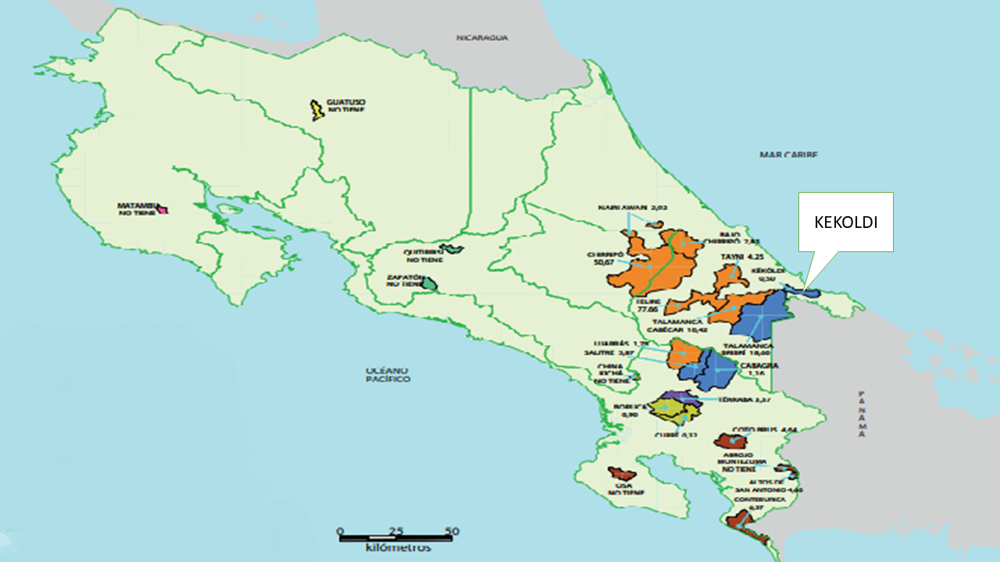

Jose Guillermo Ramirez B

\

Kekoldi quiere decir “río bastón del Awa”, (El Awa es el médico indígena Bribri)

\

Keköldi es una comunidad indígena ubicada en el cantón de Talamanca, provincia de Limón, fue creada en 1977 y tiene unos 210 habitantes.Posee un área de investigación científica y observación de aves por lo cual a nivel mundial Kekoldi es reconocido como un sitio de enseñanza, allí han llegado estudiantes, científicos y expertos a ver las aves viajar desde la torre de observación(imagen 1) que permite una vista de 360 grados. 

\
\

**Imagen 1:** vista desde la torre de observación.

\
\

La Reserva tiene un área importante de bosque primario y secundario, un área común de árboles maderables, medicinales y frutales. También existen plantaciones de cacao. Pertenece al Corredor Biológico Talamanca-Caribe, con una extensión de 36,000 hectáreas en tierra y 5,400 hectáreas en mar.(Imagen2)

\
\

**Imagen 2**: Mapa de ubicación de la estación kekoldi.
\
\

Un aspecto importante es que esta zona,  se encuentra en la ruta de las aves rapaces en la migración de América del Norte hacia Sur América, esto porque en su camino , las rapaces cruzan las tierras bajas del Caribe donde se unen en una sola ruta hacia Panamá y  eso lo convierte en un sitio obligatorio para turistas y científicos que deseen observar dicho evento. 

\
\

**Referencias consultadas.** 
\

Coto, F. G. (2016). Kekoldi: La tierra de la iguana. Biocenosis, 25(1-2).
\

Canal 7(2016). Kekoldi, territorio indígena y paraíso para el estudio de las aves migratorias. 	Recuperado de: https://www2.teletica.com/142893_kekoldi-territorio-indigena-y-paraiso-	para-el-estudio-de-las-aves-migratorias.
\

Fernández, M. R. (2011):  Reserva Indígena Kéköldi, Limón.  Recuperado de: 	http://explorecr.blogspot.com/2011/04/2011-reserva-indigena-kekoldi.html.
\

Periódico La Nación, (2001) Vuelo al sur. Recuperado de: 	http://wvw.nacion.com/dominical/2001/diciembre/09/dominical0.html.

